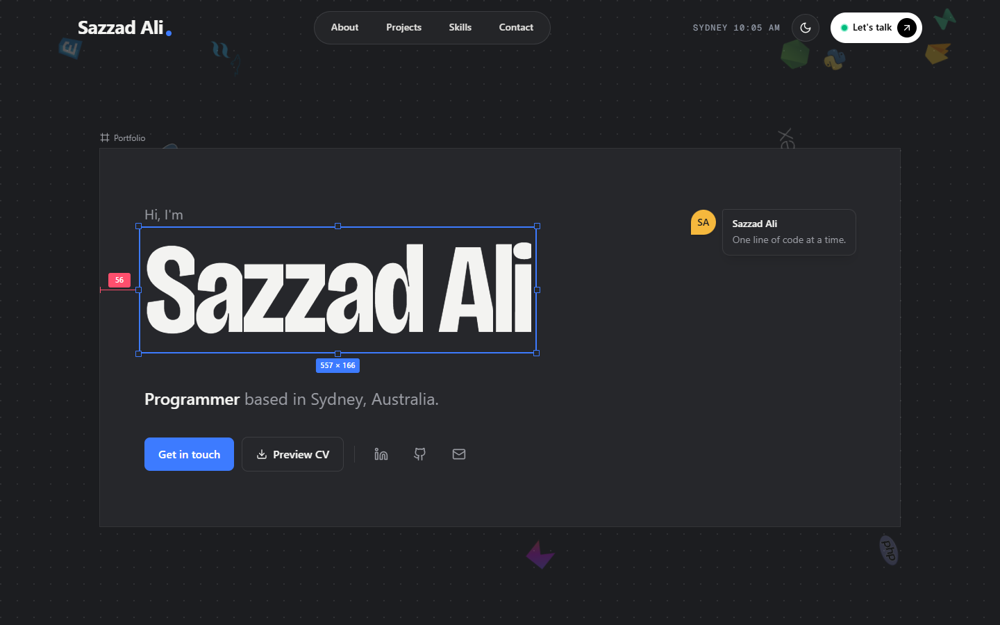

<div align="center">

# Sazzad Ali — Developer Portfolio

**A cinematic, GSAP-powered portfolio built with Next.js 15, React 19, TypeScript and Tailwind CSS 4.**

[](https://sazzadali-portfolio.vercel.app/)
[](https://ali-sazzad.github.io/sazzadali-portfolio/)

[](https://github.com/ali-sazzad/sazzadali-portfolio/actions/workflows/deploy-pages.yml)




</div>

---

## Live demos

| Target | URL | How it's built |
| --- | --- | --- |
| **Vercel** (primary) | https://sazzadali-portfolio.vercel.app | Full Next.js build with image optimisation and Vercel Analytics |
| **GitHub Pages** | https://ali-sazzad.github.io/sazzadali-portfolio | Static export (`output: "export"`) served from `/sazzadali-portfolio` |

Both deploy automatically on every push to `main`.

---

## Design concept: the workbench

I work as both a UI designer and a developer, so the site is drawn as a design file. The page is a **canvas** with faint grid lines, each section is an **artboard** with its frame name above it, and the details are the ones you see in a design tool. Every measurement shown is real:

- **Hero:** my name sits inside a live **selection box**. The W × H readout is its actual rendered size, and the red **redline** is its true distance from the artboard edge. **Drag the corner handle to resize it** (or focus the handle and use the arrow keys; Home or double-click resets). The readout updates as you go, and the size is capped so the name always fits on one line.
- **About:** the bio as a text layer, an **inspector panel** of profile properties, and the three ways I work laid out as an auto-layout row with the measured gap between them.
- **Work:** projects are **frames** on the canvas. On desktop the page pins and pans sideways across them; on phones and tablets the frames are a **touch canvas you swipe** (scroll-snap), the centred frame shows as selected and its neighbours dim. Either way a **minimap** shows where you are; tap or click a frame in it to jump there. Open a frame for its **case study** (`/work/<slug>`): properties, the screenshot as a selected frame at its real size, an overview, what was built (as a layers list) and previous/next projects. Case-study copy is drawn only from each project's own README, repository and screenshot.
- **Toolkit:** skills as a **component library**. Pick a group in the sidebar and the components re-flow.
- **Contact:** a **comment thread**. The reply box drafts an email to me in your own mail app (no backend, nothing stored).

**Tokens:** canvas, artboard, ink, muted, rule, plus one accent, *select* (blue), used for selections and primary actions. *Redline* (red) only ever appears next to a measured value, and *note* (amber) marks comment pins. Type is [Bricolage Grotesque](https://fonts.google.com/specimen/Bricolage+Grotesque) for display (its width axis is narrowed for the hero) and [Geist](https://vercel.com/font) for text.

## Motion highlights

Every animation is written with [GSAP 3.15](https://gsap.com/) and the official [`@gsap/react`](https://gsap.com/resources/React) `useGSAP()` hook, so all tweens and ScrollTriggers are scoped and cleaned up automatically. Motion is deliberately concentrated in one moment, the hero build, rather than spread over every section.

| Feature | GSAP tools |
| --- | --- |
| Intro preloader: 0→100 counter, masked name reveal, curtain wipe | `Timeline`, `SplitText` (`mask: "chars"`) |
| Hero build: name rises in, the selection outline draws itself, handles pop, the redline measures, and a ghost cursor demonstrates the resize handle | `Timeline`, `SplitText`, CSS-variable tweens |
| Resizable hero name (pointer, touch and keyboard) | `Draggable` (proxy + trigger) |
| The role under my name is a live text layer: a "Sazzad" collaborator cursor types it, keyboard-selects it (a highlight sweeps back across the word) and types the next | `Timeline` built per role, `call()` per keystroke with an uneven rhythm |
| Smooth page scrolling | `ScrollSmoother` |
| Pinned horizontal pan across project frames, with a live minimap | `ScrollTrigger` (`pin`, `scrub`) |
| Skill filtering: components re-flow, leave and enter | `Flip` |
| About copy that darkens word by word as you scroll | `SplitText` + scrubbed `ScrollTrigger` |
| Tech logos drifting across the canvas, looping forever | Randomised `fromTo` loops with `repeatRefresh` |
| Floating pill navigation: a sliding indicator follows hover and rests on the active section | `gsap.to()` on measured `x`/`width`, `mix-blend-difference` |
| Per-letter roll on nav links and CTAs; magnetic "Let's talk" button; live Sydney clock | Staggered `yPercent` tweens, `quickTo()` |
| Nav condenses on scroll, hides on scroll down, shows on scroll up; scroll progress line | `ScrollTrigger` (`toggleClass`, `direction`), `ScrollToPlugin` |
| Full-screen mobile menu: burger morphs to ✕, panel wipes in, page scroll locks | `Timeline` + `reverse()`, `ScrollSmoother.paused()` |
| Dark / light theme toggle: icon spin, and the new theme spreads from the button as a circle | GSAP + View Transitions API |
| Accessibility: decorative motion is off for users who prefer reduced motion | `gsap.matchMedia()` |

> Since GSAP became 100% free (including all former Club plugins) every plugin above ships straight from the public `gsap` npm package — no private registry or token needed.

---

## Tech stack

- **Framework:** [Next.js 15](https://nextjs.org/) (App Router) + [React 19](https://react.dev/)
- **Language:** [TypeScript 5](https://www.typescriptlang.org/)
- **Styling:** [Tailwind CSS 4](https://tailwindcss.com/)
- **Animation:** [GSAP 3.15](https://gsap.com/) + [`@gsap/react`](https://www.npmjs.com/package/@gsap/react)
- **Icons:** [Lucide](https://lucide.dev/) and [Devicon](https://devicon.dev/)
- **Hosting:** [Vercel](https://vercel.com/) and [GitHub Pages](https://pages.github.com/)

---

## Project structure

```text
sazzadali-portfolio/
├── .github/workflows/
│   └── deploy-pages.yml      # CI: lint → static export → GitHub Pages
├── public/                   # Images, favicon and CV
├── src/
│   ├── app/
│   │   ├── globals.css       # Tailwind layers + small custom utilities
│   │   ├── layout.tsx        # Fonts, SEO metadata, analytics
│   │   ├── page.tsx          # Renders <Portfolio />
│   │   └── work/[slug]/      # Case-study pages, prerendered with generateStaticParams
│   ├── components/
│   │   └── portfolio/        # One file per section (Hero, About, Projects, Skills, Contact…)
│   │       ├── Portfolio.tsx # Page shell + ScrollSmoother setup
│   │       ├── Artboard.tsx  # Section surface with frame name + heading
│   │       ├── SelectionBox.tsx # Live-measured selection outline, handles, W × H
│   │       ├── CommentPin.tsx   # Design-tool comment (hero motto, contact thread)
│   │       ├── Preloader.tsx
│   │       ├── Nav.tsx
│   │       ├── Logo.tsx      # Animated wordmark
│   │       └── …
│   ├── data/
│   │   └── portfolio.ts      # Projects, skills, links — edit content here
│   └── lib/
│       ├── gsap.ts           # Plugin registration + scroll helpers
│       └── utils.ts          # cn() and asset() helpers
├── next.config.ts            # Switches between Vercel and GitHub Pages builds
└── package.json
```

**Theming:** the site is written dark-first. [`src/app/globals.css`](src/app/globals.css) defines the workbench tokens (`--canvas`, `--artboard`, `--ink`, `--select`…) for each theme and exposes them to Tailwind (`bg-canvas`, `text-ink`, `ring-select`…). For older components it also remaps Tailwind's palette under `html[data-theme="light"]` (white ↔ ink, grays reversed), so components need no per-theme classes. The choice is saved in `localStorage` and applied by a tiny inline script before first paint, so there's no flash.

**Updating content:** projects, skills, roles and social links all live in [`src/data/portfolio.ts`](src/data/portfolio.ts). Add a project there and it appears in the horizontal gallery automatically.

---

## Getting started

**Prerequisites:** Node.js 20+ and npm.

```bash
# 1. Clone
git clone https://github.com/ali-sazzad/sazzadali-portfolio.git
cd sazzadali-portfolio

# 2. Install
npm install

# 3. Run the dev server
npm run dev
```

Open http://localhost:3000.

### Scripts

| Command | Description |
| --- | --- |
| `npm run dev` | Start the development server |
| `npm run build` | Production build (Vercel target) |
| `npm run build:pages` | Static export for GitHub Pages → `out/` |
| `npm start` | Serve the production build locally |
| `npm run lint` | Run ESLint |

---

## Deployment

### GitHub Pages

The workflow in [`.github/workflows/deploy-pages.yml`](.github/workflows/deploy-pages.yml) lints the project, runs `npm run build:pages` and publishes `out/` on every push to `main`.

One-time setup for a fork:

1. Go to **Settings → Pages**.
2. Under **Build and deployment → Source**, choose **GitHub Actions**.
3. Push to `main` (or run the workflow manually from the **Actions** tab).

How it works: when `GITHUB_PAGES=true`, [`next.config.ts`](next.config.ts) turns on `output: "export"`, sets `basePath` to `/sazzadali-portfolio` and disables the image optimiser (Pages is static hosting). The `asset()` helper in [`src/lib/utils.ts`](src/lib/utils.ts) prefixes files from `public/` with that base path. If you fork under a different repository name, update `basePath` in `next.config.ts`.

To preview the Pages build locally:

```bash
npm run build:pages
mkdir -p preview && cp -r out preview/sazzadali-portfolio   # mirror the Pages sub-path
npx http-server preview -p 8080
```

Then open http://localhost:8080/sazzadali-portfolio/.

### Vercel

The repository is connected to Vercel, so each push to `main` deploys to production and each pull request gets a preview URL. No extra configuration is needed: Vercel detects Next.js, runs `npm run build` and serves the app with image optimisation and Analytics enabled.

To deploy manually with the CLI:

```bash
npm i -g vercel
vercel          # preview
vercel --prod   # production
```

---

## Accessibility and performance

- Respects `prefers-reduced-motion`: smooth scrolling, the preloader sequence and all decorative motion are switched off.
- Semantic landmarks (`nav`, `main`, `section`, `footer`), labelled icon buttons, and `aria-live` on the rotating role text.
- The custom cursor and magnetic effects only activate on fine pointers (mouse/trackpad), never on touch devices.
- Fonts via `next/font`, responsive images via `next/image`, and the page is statically prerendered.

---

## Contact

- **Email:** [find.sazzadali@gmail.com](mailto:find.sazzadali@gmail.com)
- **LinkedIn:** [linkedin.com/in/sazzadali](https://www.linkedin.com/in/sazzadali/)
- **GitHub:** [@ali-sazzad](https://github.com/ali-sazzad)

Suggestions and pull requests are welcome — open an issue to start a conversation.

---

## License

Distributed under the MIT License. See [`LICENSE`](LICENSE) for details.

<div align="center">

Designed and developed by **Sazzad Ali** — *one line of code at a time.*

</div>
